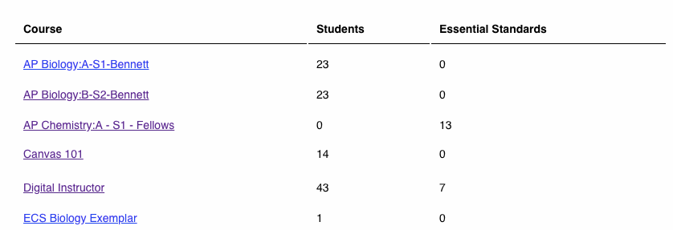
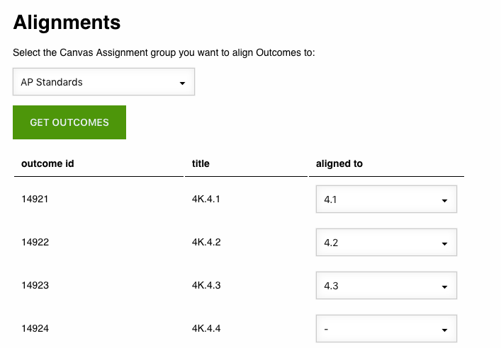
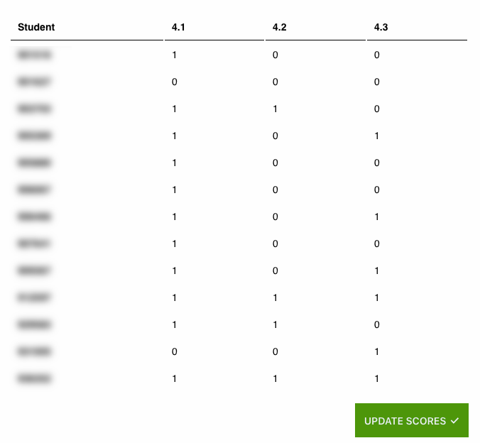

# Learning Mastery Grades Calculator

This Flask application hooks into Canvas to associate Outcome scores with actual assignments.

This project is no longer being updated. I was just learning how to develop complex applications when I made
this version, but it quickly became unsustainable. Instead of trying to untangle everything here, I've started
a new, more robust, more sustainable version of the helper [over here](https://github.com/bennettscience/canvas-lms-mastery-helper).

## What does it do?

If you want to use Outcomes to dictate assignment scores, you have to do that one by one by hand in the gradebook. This means either using a dual-monitor setup to open both at the same time or clicking back and forth for each and every assignment. This app creates a relationship between an assignment and an outcome and then uses the Canvas API to update the gradebook in bulk.

Here's a practical example:

Outcome 1.1 defines a skill students should have. An Outcome score of 3.0 is considered 'passing.' Assignment 1.1 in the traditional gradebook is set to 1/1 when a 3.0 is reached on the Outcome. Currently, you have to update this score by hand.

This app allows the instructor to set a relationship between a single Outcome and an Assignment. When the mastery score is reached on the Outcome, the Assignment is automatically toggled to full credit for each student.

## What about student data?

No student data is stored in the app. The database is used to map an Outcome to an Assignment (and vice versa) using the item ID from Canvas. When the app runs, the stored IDs are queried and loaded into the dashboard for the user. Student scores are updated in real time via the API. As soon as the user logs out, the student data is cleared from the session.

## Dependencies

`pip install -r requirements.txt`

## Config

Add a Developer Key for the application in your Canvas instance.

Set up your config with `cp config-example.py config.py` in your directory. Update your config file with your Canvas Developer Key specifics. Make sure you edit your URL root in each of the URLs listed.

The API calls to Canvas are all done with [UCF Open's CanvasAPI library](https://github.com/ucfopen/canvasapi/tree/master).

## Canvas Course Structure

The settings are not configurable right now. To use the application, you should have the following:

- Outcomes imported into your Canvas course.
- Assignments assessing the Outcomes (either quizzes or rubrics)
- Assignments to be updated by the app. **These assingments should be worth one point each.**

When a student reaches master (Outcome aggregate = 3 or higher) the linked Assignment will be toggled to 1/1. If it is below 3, the Assignment is toggled to 0/1.

## TODO

### Backend

- [x] Database models
  - [x] outcomes
  - [x] assignments
- [x] Link assignment to outcome
- [ ] Per-student reporting
- [x] Routing
  - [X] Login required view
  - [X] standardize `id` structures
  - ~~Student view?~~
- [x] Update assignment scores on Canvas
- [ ] Flask-Session for server-side key storage
- [ ] Flask-Cache to reduce API calls
- [ ] Config
  - [ ] User-defined Mastery score
  - [ ] User-defined Assignment toggle

### Authentication

- [X] OAuth2 Login
  - [x] Refresh OAuth session
- [X] `Canvas` object for API calls

### Frontend

- [x] navbar
- [ ] App config settings
- [ ] Config Canvas URL
- [x] Dashboard
  - [X] Course picker
- [ ] Course
  - [x] Define assignment category ID
    - [x] Fetch assignments in the group
  - [x] Import course outcomes by group
  - [ ] Separate rosters by course section

### Screenshots

#### Active courses

#### Align Outcomes to Assignments

#### Student scores

